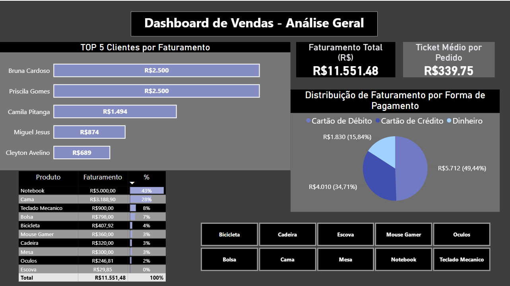

# 📊 Dashboard de Vendas - Análise Geral

## 📌 Sobre o projeto
Este projeto tem como objetivo analisar dados de vendas utilizando SQL e Power BI.

---

## 🚀 Tecnologias utilizadas
- SQL (MySQL)
- Power BI

---

## 📊 Indicadores
- Faturamento total
- Ticket médio
- Top 5 clientes
- Distribuição por forma de pagamento
- Filtro de produtos e Valores respectivos

---

## 📷 Dashboard

---

## 📂 Estrutura
- dashboard.pbix
- database.sql
- queries.sql

---

## 👨‍💻 Autor
Cleyton Avelino
